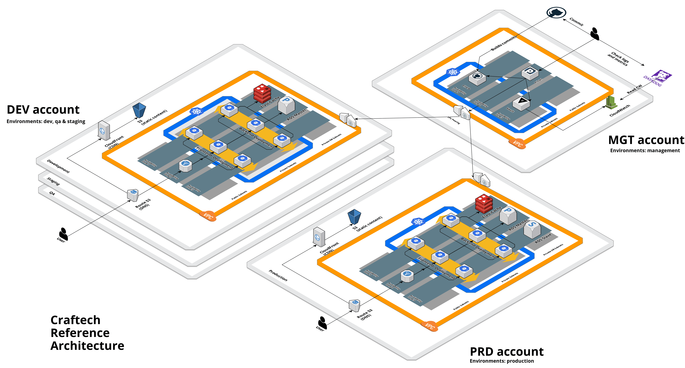
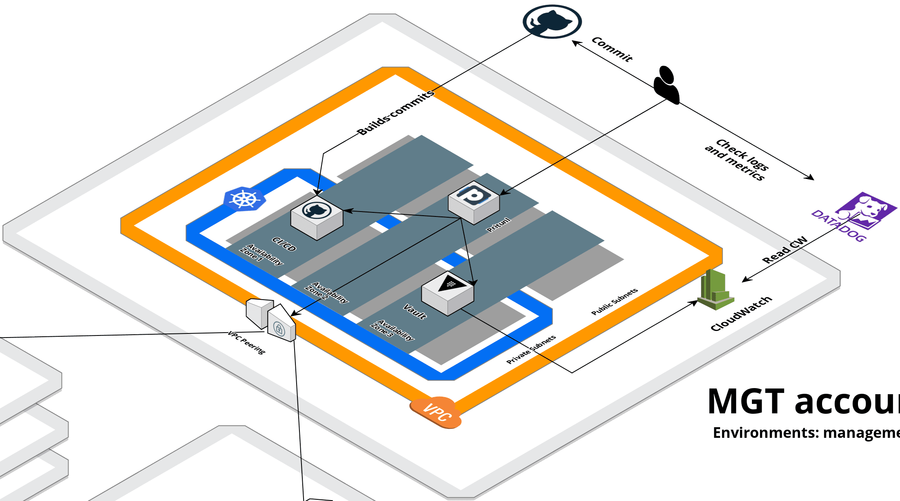
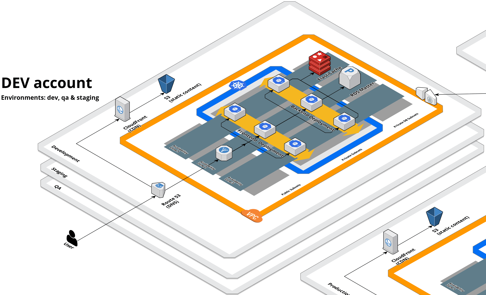

# Deployed Architecture

&emsp;&emsp;The initially created architecture when the infrastructure is deployed through **SleakOps** follows the next reference diagram:

&emsp;&emsp;As it can be seen, the infrastructure is divided on three VPCs, each corresponding to one account destinated to work as differentiated deployments that have their own functions. First of all, as developers we interact directly with the _management_ environment, it is connected via VPC Peering to the PRD account that contain the _prod_ environment and also to the DEV account that has three diferentiated environments, _dev_, _qa_ and _staging_, all of this four environments work as isolated from the others. Next, we explain briefly how all the VPCs are implemented and what resources each one have.

## MGT account VPC, management environment:

&emsp;&emsp;When working on management we interact directly through a VPN Server created with Pritunl. Pritunl has a high availability approach and not only works as a VPN giving us a safer way to manage network traffic, it's also well integrated with most of common cloud providers and capable to work with automatic failover and horizontal scaling, both caracteristics that are generally used on cloud resources, this is all thanks to his advanced automated VPC routing table management that shine when changes are needed. This VPN Server is configured on a public subnet configure inside the VPC to make possible for us to send data through it.

&emsp;&emsp;Inside the VPC we also have a private subnet where we can find an Eks cluster with the configured CI/CD of Github and HashiCorp Vault. Vault is a secret management tool where different credentials or keys are stored and it's also used as authentication controller to admit or prohibit access to data, on this distribution Vault manages the credentials for CloudWatch, an AWS resource that collects monitoring data from infrastructure that later is send to DataDog to use it for a better logs and metrics description.

&emsp;&emsp;As it has been said at the beginning, this VPC connects with the others accounts via a private VPC Peering that is created to route traffic between them.

## PRD account VPC, prod environment:

&emsp;&emsp;This environment needs the required resources and connections to be completely usable by external users, because of that a totally funtional database (DB) is needed. Being that said, the VPC contains three subnets, starting with the new one, a Private DB Subnet is established to contain the Relational Database Service Master (RDS Master), the RDS Slave and ElastiCache, every one is deployed over a different Availability Zone (AZ) to better accomplish the desired high availability.

&emsp;&emsp;DBs are connected with the Backend Deployment that's inside the Private Subnet, it has three pods or replicas of the deployed application distributed on different AZs. Connected to Backend we have the Frontend Deployment, as can be seen, here we use the same distribution used on Backend. All this is contained inside an EKS cluster that have all the replicas and it can switch over the replicas to maximize availability and performance of our app.

&emsp;&emsp;The Public Subnet is the connection of users to the deployed application, here we assign a LoadBalancer to distribute network load to the different Frontend pods to not overcharge with requests any of them. Every user sends his requests and they are taken by the LoadBalancer through an AWS resource called Route53 that works as a DNS, in addition, it carries out certain health checks and other kinds of monitoring to the app. Route53 uses AWS CloudFront to serve the static content of the frontend to the users, all this resources are stored on a S3 bucket.

&emsp;&emsp;Back to the DBs, the main one being used by the Backend is called RDS Master, on the other AZ, we have RDS Slave, this one is an exact replica of Master that exists only for situations where any failure occurs to Master, if this happen, AWS instantly changes Slave to be the main DB to keep the app working while trying to restart Master. After this rotation, Slave ends acting as Master so, when the previous Master starts again, it is now being the new RDS Slave. We can say that they change places when a failure emerge on Master in order to maximize the uptime of our app. ElastiCache has the function of memory cache storage.

## DEV account VPC, _dev_, _qa_ and _staging_ environment:

&emsp;&emsp; On the DEV account we find three different environments, _dev_, _qa_ and _staging_, they are meant to be replicas (or almost) of _prod_ environment, on these environments is where code is written, tested and pre-released respectively before releasing it to _prod_ environment. This is done this way to avoid that external users suffer different errors, bugs or even to abuse possible security holes that can arise after changes on the main code.

&emsp;&emsp; Analyzing the diagram, the only difference on the deployed infrastructure between _prod_ and all the environment found on DEV account is that they do not have RDS Slave, this is because it is not really needed, you don't want this environments to have the extremely high availability you expect and want to serve to the users that interact with _prod_.
